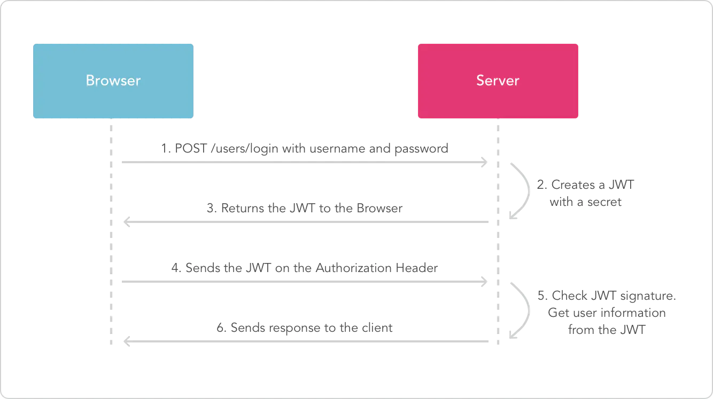

# Go-jwt 用户验证的简易实现

使用GIn和dgrijalva/jwt-go完成token验证方式。 
### 这份代码主要完成三个功能
- 客户端登录时生成对应token并返回
- 客户端访问时验证token
- 验证并刷新即将过期的token
  
基于token的验证方式流程如下图

 

  

    
  

  <h3 align="center">jwt验证流程</h3>

token的使用场景一般是API接口的开发，微服务中使用，更加适合与那些一次性短期的命令认证，而传统的cookie-sessin模式在web场景下依然是够用的

### JWT的学习
推荐的文章
- [JWT（详解）](https://blog.csdn.net/weixin_44736637/article/details/124005231)
- [什么是JWT](https://zhuanlan.zhihu.com/p/99705304)
- [GO-JWT实现](https://learnku.com/go/t/52399)

